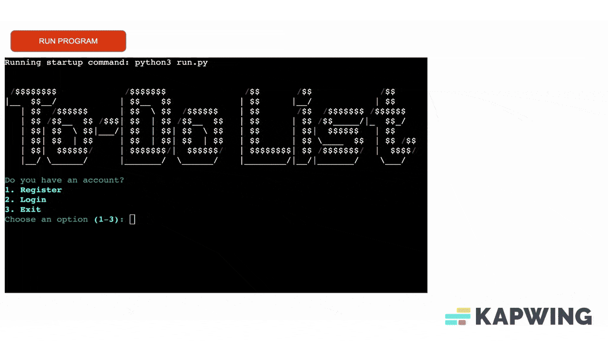

# To-Do List
**To-Do List** is a command-line interface (CLI) for a simple to-do list manager with user registration, login, and various task management functions. It utilizes JSON to store user data, bcrypt for password hashing, and Rich for styled CLI output. Key features include: i) *User Authentication*: Users can register or log in, with passwords stored securely in hashed form, ii) *Task Management*: Users can add, delete, edit, and mark tasks as done, iii) *Filtering and Searching*: Tasks can be filtered by priority or searched by keyword, iv) *Sorting*: Tasks can be sorted by due date for easy tracking, v) *Data Persistence*: User and task data are saved in a JSON file for data persistence across sessions. The program uses Rich library for enhanced CLI visuals and offers a menu-driven interface for ease of use. The main loop allows users to interact with tasks until they choose to log out or exit the program. This project appeals to anyone seeking a streamlined, code-driven way to stay organized and productive in a customizable, offline environment.

To test the application use the following user data to login:
- username: **evanthia**
- password: **123456**

The test user already contains a list of to-do tasks. Of course, you can also create a new user and add your own tasks.

[Link to live project](https://to-do-list-mgmt-80fbcde49609.herokuapp.com/)


 * [To-Do List](#to-do-list)
   * [Table of Contents](#table-of-contents)
   * [Introduction](#introduction)
       * [Description](#description)
       * [Purpose](#purpose)
       * [User Demographic](#user-demographic)
       * [Flowchart](#flowchart)
   * [Existing Features](#existing-features)
       * [Welcome screen](#welcome-screen)
       * [Register](#register)
       * [Login](#login)
       * [Add Task](#add-task)
       * [Delete Task](#delete-task)
       * [Mark Task](#mark-task)
       * [Edit Task](#edit-task)
       * [Show All Tasks](#show-all-tasks)
       * [Tasks by Priority](#tasks-by-priority)
       * [Keyword Search](#keyword-search)
       * [Tasks by Due Date](#tasks-by-due-date)
       * [Logout](#logout)
       * [Future Enhancements](#future-enhancements)
   * [Technologies Used](#technologies-used)
       * [Overview](#overview)
       * [Tools](#tools)
       * [Libraries](#libraries)
       * [Requirements](#requirements)
   * [Manual Testing](#manual-testing)
   * [Deployment](#deployment)
   * [Credits](#credits)

<!-- table of contents created by Adrian Bonnet, see https://github.com/Relex12/Markdown-Table-of-Contents for more -->
## Table of Contents

## Introduction

### Description
Here are the key features of this Python-based task manager (must-have):
- Task Management: Allow users to add, edit, delete, and mark tasks as done, keeping track of priority levels, due dates, and completion status.

- User Authentication and Data Security: Ensure data privacy and security by implementing a login system with secure password hashing. This allows multiple users to maintain separate task lists and prevents unauthorized access.

- Data Persistence: Enable data persistence across sessions using JSON, so users can retain their task lists between uses of the program.

- CLI-based Usability: Make the tool accessible from the command line with intuitive menu navigation, styled with Rich for an improved CLI experience.

### Purpose
The purpose of this project is to create a command-line task manager that enables users to manage their personal to-do lists with ease. Designed for simplicity and security, the application offers a robust feature set within a user-friendly interface. This tool is ideal for users who prefer a straightforward, text-based task manager and who value control over their task lists without relying on external applications or GUIs. It’s a foundational project for learning about user authentication, data management, and creating interactive command-line applications.

### User Demographic
The target audience for this Python-based task manager includes i) **Developers and Tech Enthusiasts**: Users comfortable with command-line interfaces who prefer minimalistic, non-GUI tools for personal productivity, ii) **Beginner Programmers**: Individuals looking to learn how to manage data, implement secure password hashing, and build interactive CLI applications in Python, iii) **Productivity-Focused Individuals**: People who enjoy organizing tasks and managing to-do lists, especially those who want a lightweight, distraction-free solution that doesn’t rely on complex software or internet access, iv) **Privacy-Conscious Users**: Users who prefer a personal, offline task manager without cloud dependencies, ensuring their task data stays on their device, and finally v) **Students and Educators**: Individuals in educational environments, where such a program can serve as a project to learn about user data handling, file I/O, and secure password management.

#### As a first time user, I'd like to:
- **Register**: create an account and log in.
- **Add Task**: create a to-do list with my upcoming tasks.
- **Organize**: save my tasks in the to-do list and be able to mark them as done according to date.
- **Access**: navigate my to-do tasks with an intuitive and visually appealing interface.
- **Manage**: view, search, edit, and delete tasks from the list with a keystroke.
- **Feed back**: get clear feedback from the application.
- **Experience**: enjoy a user-friendly program, even without any prior experience with terminal-based applications.

#### As a frequent user, I'd like to:
- **Authenticate**: access the application with passwords stored securely in the appropriate file.
- **Access**: retrieve quickly previously added to-do lists for efficient user interaction.
- **Manage**: streamline to-do list tasks with powerful batch editing and deletion features.
- **Personalize**: customize my experience by setting preferred task priority, due date, completion process.
- **Uncover**: handle large amounts of to-do list tasks that can be sorted by due date and priority level for easy tracking
- **Filter**: search effortlessly for specific tasks by keyword.
- **Upcycle**: focus on the program's reliability, responsiveness, and fast performance for all my to-do list tasks.

### Flowchart

The particular flowchart visually represents the sequence of steps, decisions, and processes involved before the development stage. I tried to break down complex processes into clear, manageable steps, making it easier to understand and follow. By mapping out each step, the graph helped me identify inefficiencies, redundancies, or potential problem areas in the workflow and the program logic. The relevant flowchart acts as blueprint, guiding the coding and debugging process and making it easier to maintain and update the system later. It also serves as documentation for how the program or the system works, which is helpful for future reference, onboarding new team members, or explaining the system to non-technical users. Additionally, I wanted to generate a graph that provides a common visual language for all stakeholders (developers, users, managers, etc.), facilitating clear communication about how a process works or how a program functions. 

To visualize the necessary steps to create the to-do list manager, I created the flowchart below using [Lucidchart](https://www.lucidchart.com/) in order to map out logic in decision-making, loops, input/output operations, and error handling, providing a clear overview before diving into coding.


## Existing Features

### Welcome screen
On the welcome screen, ASCII Art with the name of the application is displayed. Underneath the welcome message, the user can decide whether they want to register, login, or exit the program. The input is validated to be either 1, 2 or 3.


### Register
Users have to create an account in order to be able to store and view their to-do list tasks. A username and password have to be entered. After validation, they are stored in a .json file and the user is redirected to the Login. The username is validated to have at least 4 characters and is stored as all lowercase. Furthermore, the method ensures that the username is not taken. The password has to be at least 4 characters long as well. The user can enter exit the program instead of creating an account or logging in. 


### Login
A user that already created an account can log in by entering their username and password. The method validates the input by checking if the username exists in the users.json file and if the password that is entered is identical to the one stored. For security reasons, I used getpass to hide the input while typing in the password. The user should finish the process before he/she enters the main menu screen.


### Add Task
A user that already has an account can easily add a task to the to-do tasks list. The method validates the input by checking if the task name has the correct description (no empty spaces or numbers are allowed to describe the task), priority level and due date. Then the task appears to the task table list created with rich library for a comprehensive user interface.


### Delete Task
A user that already has an account can easily delete a task from the to-do tasks list. If the to-do list is empty, the program notifies via the terminal the user accordingly. In order to delete a task, the user should type the correct task number from the table provided. In order to confirm that the task is successfully deleted the user should view all tasks.



### Mark Task
A user that already has an account can easily mark a task as done from the to-do list. To do so the user has to make sure that tasks have been added to the to-do list. If the to-do list is empty, the program notifies via the terminal the user accordingly. In order to confirm that the task is successfully marked as done the user should view all tasks. 


### Edit Task
A user that already has an account can easily edit a task from the to-do list. To do so the user has to make sure that tasks have been added to the to-do list. If the to-do list is empty, the program notifies via the terminal the user accordingly. In order to confirm that the task is successfully edited, the user should view all tasks. The method validates the input by checking if the task name, priority level and due date all have the correct format.


### Show All Tasks
A user that already has an account can easily view all tasks from the to-do list. To do so the user has to make sure that tasks have been added to the to-do list. The method validates the input by checking if the choice is included between the desired numerical range.


### Tasks by Priority
A user that already has an account can easily filter tasks by priority level. To do so the user has to make sure that tasks have been added to the to-do list. From the main menu the user has to select 'Tasks by Priority' and then is called to type the priority level (e.g. high, medium, low) he/she wishes to view.


### Keyword Search
Additionally, the program offers the function of keyword searching. The user has to login in the account and add tasks in the to-do list first. In case the to-do list is empty, the program notifies via the terminal the user accordingly. User can type a keyword and then the program returns the result inside the table to-do list.


### Tasks by Due Date
This function is optional but I added the a method of filtering tasks by due date in the main menu. The particular method returns all tasks ordered by date. By default the program stores the tasks with random dates, however if the user selects the 'Tasks by Priority' function can view the results ordered by date.


### Logout
Once the user has explored the to-do list application, can easily logout from the program by selecting the relevant option from the main menu. The application further gives the option to end the program by selecting the exit option from the initial menu.


### Future Enhancements
The project is ready for production and has implemented all the planned features. Some additions I would like to make to this application in the future are:

- Connect the program to a real database instead of the worksheets.
- Make the to-do list downloadable and convert it to a PDF file. After doing some research, I think it should be possible to convert a to-do list to a PDF file the user can download. However, that is a project for the future and no necessary feature for this project.

## Technologies Used

### Overview
The project structure is built upon the [Code Institute Project 3 template](https://github.com/Code-Institute-Org/p3-template), including custom Python code, along with the integration of ASCII art and rich library for visual appeal and user interface enhancement.

### Tools
- **Git** Used for version control eg. git add - commit - push
- **Github** Used as the hosting platform for the repository.
- **Gitpod** Used as the IDE for writing, editing and debugging code.
- **Heroku** Used for deploying the application.
- **Python** Used as the programming language for creating the application.
- **.json** Used to save and load tasks in memory (e.g., in a Python dictionary)
- **bcrypt** Used for securely hashing and verifying passwords.
- **getpass** Used to prevent the typed characters from being displayed on the screen.
- **rich** Used to create visually appealing tables and styled output in the terminal.

### Libraries
```import json``` Saves configurations, transfers data between applications, and handles API responses in Python program.<br>
```import os``` Performs tasks such as file manipulation, directory management, environment variable access, process control.<br>
```import bcrypt``` Provides hashing functions that are commonly used for securely storing and verifying passwords.<br>
```import getpass``` Provides a way to securely handle password input in command-line interfaces by hiding the input from display.<br>
```from rich.console import Console```Creates visually appealing and informative outputs in the terminal, easily adds colors, styles, and other formats without complex string manipulation, logs messages with timestamps, providing better debugging capabilities.<br>
```from rich.table import Table``` Create and displays tables in the terminal with extensive styling and formatting options.<br>
```from datetime import datetime``` Allows you to create, format, manipulate, and perform arithmetic on date and time objects.<br>

### Requirements
```bcrypt==4.2.0``` Provides functionality to help protect sensitive data, particularly passwords, by implementing the bcrypt hashing algorithm. <br>
```PyQt5==5.15.11``` Provides robust capabilities for GUI-based applications in Python and allows for a high degree of customization for creating professional applications.<br>
```PyQt5-Qt5==5.15.15``` Provides the core components used by PyQt5 to build and manage cross-platform GUIs.<br>
```PyQt5_sip==12.15.0``` Acts as a bridge between Python and C++ for PyQt5 applications.<br>
```rich==13.9.2``` Provides rich text and beautiful formatting in the terminal.<br>


## Manual Testing

## Deployment

## Credits